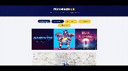
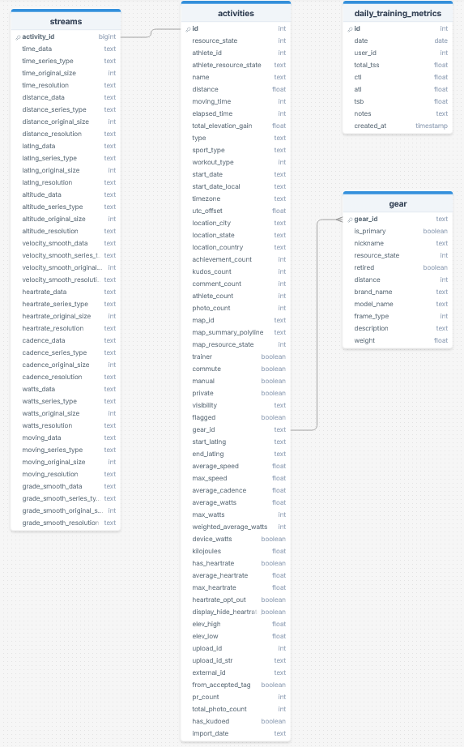
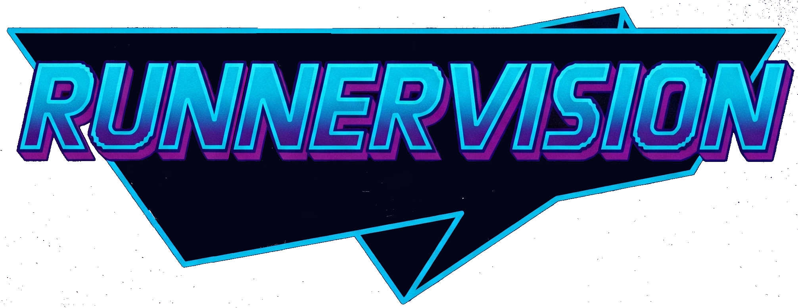
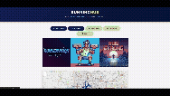
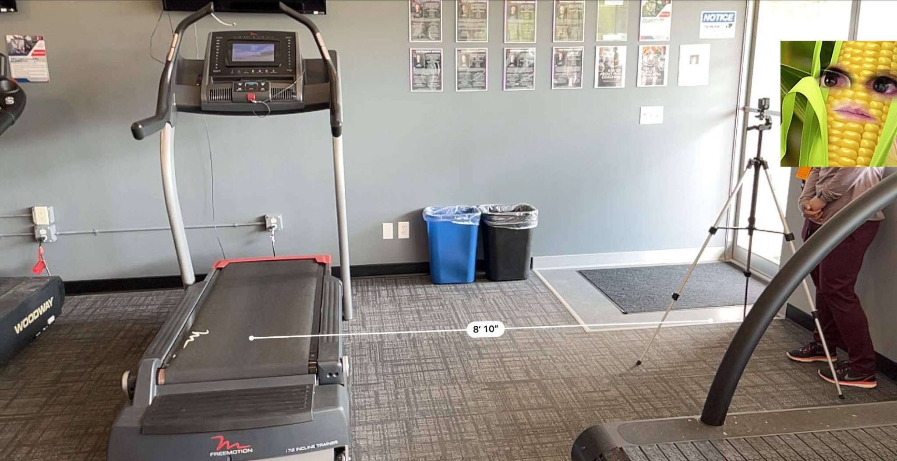
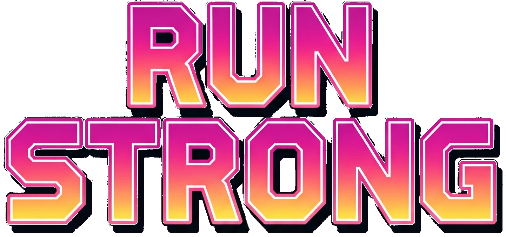
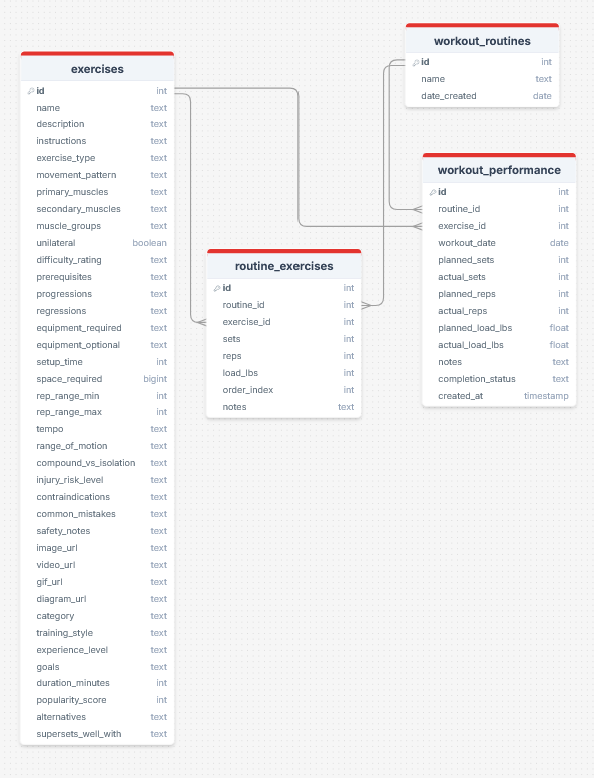
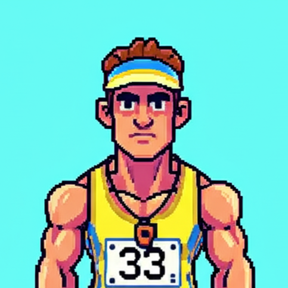

# Running Hub Analytics

A modular, open-source project for runners and coaches to analyze running data, visualize training history, detect metric changes, and generate summaries using machine learning and language models.



RunningHub is the primary metrics engine and visualization foundation, supported by 3 dedicated pillars. 
* [RunnerVision](#runnervision), which provides running biomechanic analysis of video taken from the rear and right side of a runner
* [RunStrong](#runstrong), a strength training supplement that allows the building of routines and tracking of strength training data
* [Coach G](#coach-g), a language model integrated over top of the data generated by the other pillars

## 🚀 Project Goals

* Provide a user-friendly web interface to visualize and analyze running data.
* Offer detailed breakdowns of performance metrics over time.
* Detect changes in performance using machine learning.
* Summarize recent workouts and trends using a local LLM.
* Use open-source tools, containerized deployment, and modular architecture.

## 🧱 Technology Stack

| Feature           | Current Tool(s)                                        |
| ----------------- | ------------------------------------------------------ |
| Web Interface     | Flask                                                  |
| Dashboards        | Dash, Javascript                                       |
| Data Storage      | SQLite                                                 |
| Metrics Analysis  | `pandas`, `scipy`, `plotly`, `numpy`                   |
| ML Models         | `scikit-learn`, `ruptures`, `xgboost`                  |
| LLM Summaries     | `transformers`                                         |
| Data Ingestion    | Custom Pipeline (Python)                               |
| Authentication    | Flask-Login                                            | * Planned
| Containerization  | Docker, Docker Compose                                 | * Planned
| DevOps Monitoring | Grafana + Prometheus (for server/app health)           | * Planned

## 🔄 Data Sources

* **Strava API** 

## Strava Data ERD



# RunnerVision


A running biomechanic analysis system for analyzing running form using computer vision and wearable data integration.

## Overview


RunnerVision uses computer vision (BlazePose) to provide detailed analysis of running biomechanics. The system captures, processes, and visualizes key running form metrics to track improvements and identify potential issues before they lead to injury.


## Features

### 📌 Current Features 
- Multi-angle video capture protocol (side and rear views)
- BlazePose skeleton tracking implementation
- Core running metrics calculation:
  - Foot strike pattern (heel/midfoot/forefoot)
  - Foot landing position relative to center of mass
  - Posture and trunk position
  - Arm carriage and crossover
- Basic report generation with key metrics

### 🚀 Planned Features
- Longitudinal tracking of metrics over time, stored in central database
- Machine learning model for form optimization recommendations
- Comparison to elite runner benchmarks
- Video processing outside of controlled environments for more natural analysis (drone capture)
- Automatic detection of fatigue-based form deterioration
- Integration with training log data for performance correlation
- Injury risk assessment based on biomechanical patterns

## 🛠️ Setup Requirements

### Hardware
- 2× smartphone cameras or GoPro with tripods
- Treadmill with consistent lighting
- Computer with GPU support (recommended)

### Software Dependencies
- Python 3.8+
- OpenCV
- MediaPipe (for BlazePose implementation)
- TensorFlow or PyTorch
- Pandas and NumPy for data processing
- Matplotlib/Plotly for visualization
- Flask for UI

## Usage

### Data Collection Protocol

#### Biomechanics Recording Setup
For consistent data collection with phone cameras:

##### Camera Positioning:
- Camera 1 (Side View): Mount at hip height, exactly perpendicular to treadmill, 8-10 feet away

Example Placement:


- Camera 2 (Rear View): Mount at hip height, directly behind treadmill, 6-8 feet away

Example Placement:


- Use tripods with measurements marked on floor with tape for reproducibility
- Mark camera positions with tape on floor


##### Environment Control:
- Consistent lighting (avoid shadows/backlighting)
- Solid-colored backdrop if possible
- Record at same time of day to control for fatigue variables

#### Subject Preparation:
- Shirtless or a form-fitting shirt with shorts in contrasting color to skin or shirt
- Consistent bright-colored shoes

### Recording Protocol:
- 60fps
- Record 60 seconds at each pace (easy, moderate, threshold)
- Include 10-second countdown before each recording
- Capture complete warm-up, main set, and cool-down sequences

### Video Modification Protocol
Using a tool like OpenShot Video Editor, sample your video then export with the following settings:

#### Rear/Upright Video: 
- Description: FHD Vertical 1080p 59.94 fps
- Width: 1080
- Height: 1920
- FPS: 59.94
- DAR: 9:16
- SAR: 1:1

#### Side/Landscape Video:
- Description: FHD 1080p 60 fps
- Width: 1920
- Height: 1080
- FPS: 60
- DAR: 16:9
- SAR: 1:1


# RunStrong


A modular, open-source strength training resource for runners.

## 🚀 Project Goals

* Provide a user-friendly web interface to evaluate and plan strength workouts

## 🔄 Data Sources

* **User Provided** 

## Database ERD




## 📦 Initial Features (Phase 1)

* [ ] 


## 📅 Planned Features (Backlog)

* [ ] Authentication (Auth0 or internal)
* [ ] REST API endpoints for mobile app access
* [ ] Integration with training plans & schedule data
* [ ] Personalized exercise recommendations engine 
* [ ] Multi-user support


# Coach G



Language model currently running google/gemma-2-2b-it

## 📦 Initial Features (Phase 1)

* [ ] Dockerized Flask backend + SQLite DB
* [X] Heatmap visualization
* [X] Metrics analysis dashboard (HR, cadence, stride length, power)
* [ ] Time-based filters for session comparison
* [ ] Simple ML change detection (e.g., stride length anomalies)
* [ ] LLM summarizer API for weekly insights

## 🛠️ Architecture (Simplified)

```
[ User Interface (Flask/Dash) ]
          |
  [ Metrics API / Upload API ]
          |
    [ Postgres + PostGIS ]
          |
   [ ML Pipeline (sklearn, etc) ]
          |
 [ Local LLM Summary Engine ]
          |
 [ Docker Compose / Monitoring Layer ]
```

## 📅 Planned Features (Backlog)

* [ ] Authentication (Auth0 or internal)
* [ ] REST API endpoints for mobile app access
* [ ] Integration with training plans & schedule data
* [ ] Personalized recommendations engine (e.g., "your stride length has dropped 4% since your last race")
* [ ] Multi-user support and role-based access

## 📚 Documentation

* Written with Markdown + MkDocs for clean, static documentation.
* Dev and data onboarding guides.
* Example GPX, JSON, and dashboard previews included.

## 🤝 Contribution Guidelines

* Fork the repo and set up Docker locally.
* Submit well-documented pull requests.
* Open issues for bugs, feature requests, or ideas.

## 📜 License

MIT License

---

Feel free to contribute or adapt this hub for your own running or coaching needs!
