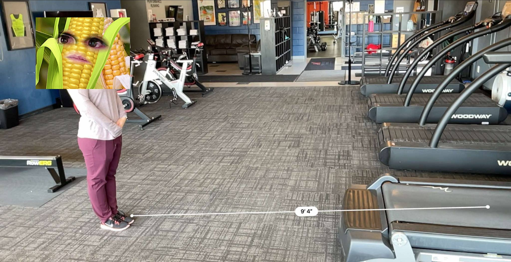

# RunningHub Analytics

A modular, open-source project for a runner to analyze various aspects of their running data, from visualize training history and fatigue metrics, to tracking strength workouts, and generate summaries using machine learning and language models.

RunningHub is the primary metrics engine and visualization foundation, supported by 3 dedicated pillars. 
* [RunnerVision](#runnervision) - provides running biomechanic analysis of video taken from the rear and right side of a runner
* [RunStrong](#runstrong) - a strength training supplement that allows the building of routines and tracking of strength training data
* [Coach G](#coach-g) - a language model integrated over top of the data generated by the other pillars

## RunningHub Demo

## 🎯 Project Goals

* Provide a user-friendly web interface to visualize and analyze running data
* Offer detailed breakdowns of performance metrics over time, including clinical fitness metrics like TSS, TSB, CTL, and ATL
* Detect changes in performance using machine learning
* Summarize recent workouts and trends using a local SLM
* Integrate multiple SOTA analytical approaches, from language models, to computer vision and classical ML techniques
* Use open-source tools, containerized deployment, and modular architecture

## 🧱 Technology Stack

| Feature           | Current Tool(s)                                        |
| ----------------- | ------------------------------------------------------ |
| Web Interface     | Flask                                                  |
| Dashboards        | Dash, Javascript, HTML                                 |
| Data Storage      | SQLite                                                 |
| Metrics Analysis  | `pandas`, `scipy`, `plotly`, `numpy`                   |
| ML Models         | `scikit-learn`, `ruptures`, `xgboost`                  | * Planned
| LLM Summaries     | `transformers`                                         |
| Data Ingestion    | Custom Pipeline (Python)                               |
| Containerization  | Docker, Docker Compose                                 | * Planned
| DevOps Monitoring | Grafana + Prometheus (for server/app health)           | * Planned

## Features

### 📌 Current Features 
- Recent Activities page showing basic summary metrics and key time series data of a run
- Statistics page with summary metrics over multiple timeframes
  - Includes shoe tracking as well as a heatmap of routes covered
- Trophy Room includes all time stats across major distance races
- Dashboard section includes numerous fitness metrics to gauge current freshness and fatigue
  - Acute:Chronic Workload Ratio (ACWR) Trend
  - Heart Rate Drift
  - Cadence Stability
  - Chronic Training Load (CTL)
  - Acute Training Load (ATL)
  - Training Stress Balance (TSB)
  - Training Stress Score (TSS)
  - Custom Training Shape over Time
  - Multiple Efficiency Metrics

### 🚀 Planned Features
- Improved analysis for individual activities
- Additional summary insights on statistics
- Skill Tree, Progress Bar, and Medals for the Trophy Room
- Cleaner integration of dashboard metrics to provide athlete alerts and data for the language model

## 🔄 Data Sources - The Strava API

### Strava Data ERD

# RunnerVision

A running biomechanic analysis system for analyzing running form using computer vision.

## Overview

RunnerVision uses computer vision (BlazePose) to provide detailed analysis of running biomechanics. The system captures, processes, and visualizes key running form metrics to track improvements and identify potential issues before they lead to injury.

## Demo

## Features

### 📌 Current Features 
- Multi-angle video capture protocol (side and rear views)
- BlazePose skeleton tracking implementation
- Core running metrics calculation:
  - Key Side Metrics
    - Foot strike pattern (heel/midfoot/forefoot)
    - Foot landing position relative to center of mass
    - Posture and trunk position
    - Knee angle
  - Key Rear Metrics
    - Left/Right foot crossover
    - Hip Drop
    - Pelvic Tilt
    - Shoulder Rotation
- Basic report generation with key metrics and figures
- Video output with frame by frame metric values
- Language model driven analysis

### 🚀 Planned Features
- Longitudinal tracking of metrics over time, stored in central database
- Machine learning model for form optimization recommendations
- Comparison to elite runner benchmarks
- Video processing outside of controlled environments for more natural analysis (drone capture)
- Automatic detection of fatigue-based form deterioration
- Integration with training log data for performance correlation
- Injury risk assessment based on biomechanical patterns
- Scoring metrics to grade overall form as a quick proxy for the runner's current status
- Many additional metrics already capture in need of clinical validation and integration into reporting

## 🛠️ Setup Requirements

### Hardware
- 2× smartphone cameras or GoPro with tripods
- Treadmill with consistent lighting
- Computer with GPU support (recommended)

### Software Dependencies
- Python 3.8+
- OpenCV
- MediaPipe (for BlazePose implementation)
- TensorFlow or PyTorch
- Pandas and NumPy for data processing
- Matplotlib/Plotly for visualization
- Flask for UI

## Usage

### Data Collection Protocol

#### Biomechanics Recording Setup
For consistent data collection with phone cameras or a GoPro:

##### Camera Positioning:
- Camera 1 (Side View): Mount at hip height, exactly perpendicular to treadmill, 8-10 feet away

Example Placement:

- Camera 2 (Rear View): Mount at hip height, directly behind treadmill, 6-8 feet away

Example Placement:

- Use tripods with measurements marked on floor with tape for reproducibility
- Mark camera positions with tape on floor

##### Environment Control:
- Consistent lighting (avoid shadows/backlighting)
- Solid-colored backdrop if possible
- Record at same time of day to control for fatigue variables

#### Subject Preparation:
- Shirtless or a form-fitting shirt with shorts in contrasting color to skin or shirt
- Consistent bright-colored shoes

### Recording Protocol:
- 60fps
- Record 60 seconds at each pace (easy, moderate, threshold)
- Include 10-second countdown before each recording
- Capture complete warm-up, main set, and cool-down sequences

### Video Modification Protocol
Using a tool like OpenShot Video Editor, sample your video then export with the following settings:

#### Rear/Upright Video: 
- Description: FHD Vertical 1080p 59.94 fps
- Width: 1080
- Height: 1920
- FPS: 59.94
- DAR: 9:16
- SAR: 1:1

#### Side/Landscape Video:
- Description: FHD 1080p 60 fps
- Width: 1920
- Height: 1080
- FPS: 60
- DAR: 16:9
- SAR: 1:1

# Coach G

## Overview

Coach G represents an old school track coach persona that is built to deliver advice to runner's both on specific topics and with sourced data, as well as general advice.

The language model currently running is google/gemma-3-1b-it

## Demo

## Features

### 📌 Current Features 
- Prebuilt route to provide a summary of a runner's current fatigue values
- Ability to reply to general questions with reasonable precision
- Personality selection to make the interaction more useful or entertaining

### 🚀 Planned Features
- Ability for Coach G to query the database and return results relevant to the user's query
- Integration across all data being stored in the RunningHub platform
- Additional prebuilt options to answer user's day to day status questions
- Continued speed and response enhancements

# RunStrong

A simple strength training resource for runners, meant to allow the building of strength routines, recording of weight sessions, and visualization of progress and fatigue over time.

## Overview

* Provide a user-friendly web interface to evaluate and plan strength workouts

## Features

### 📌 Current Features 
- Browsable exercise library of running focus strength exercises
- Routine building page to save frequently used workout clusters to the database
- Workout journal to record a workout for a specific day, as well as supplemental data used for fatigue calculation and tracking
- Fatigue dashboard, meant to centralize information about recently worked muscle groups and overall prioritization

### 🚀 Planned Features
- Database schema rebuild
- UI enhancements
- Dashboard page rebuild
- Routine recommender for when a runner isn't sure what to focus on, where recently used muscle groups can be deprioritized
- Integration with recent running workouts to determine an overall picture of fatigue
- Integration with language model (Coach G) to be able to make precise recommendations about a runner's state

## 🔄 Data Sources (User Provided Input)

## Database ERD

## 🤝 Contribution Guidelines

* Fork the repo and set up Docker locally.
* Submit well-documented pull requests.
* Open issues for bugs, feature requests, or ideas.

## 📜 License

MIT License

---

Feel free to contribute or adapt this hub for your own running or coaching needs!
