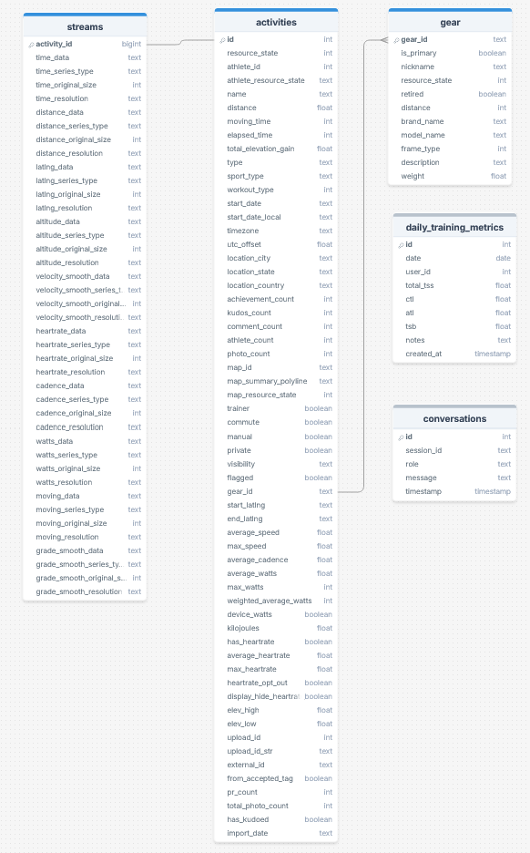

# RunningHub Core

This is the main web interface for runners to view, summarize, and understand their running performance over time.

## Features

### 📌 Current Features 
- Recent Activities: view time series and key metrics
- Statistics: aggregate views of metrics and shoe tracking
- Heatmap of covered routes
- Trophy Room: personal bests and race history
- Dashboards with metrics:
  - ACWR Trend
  - HR Drift
  - Cadence Stability
  - CTL / ATL / TSB / TSS
  - Training shape and efficiency metrics

### 🚀 Planned Features
- Deeper activity-specific analysis
- Enhanced summary insights
- Skill Tree, Progress, and Medals system
- Alert system for outlier events in data
- Stronger integration with Coach G

## Strava Data

### ERD
