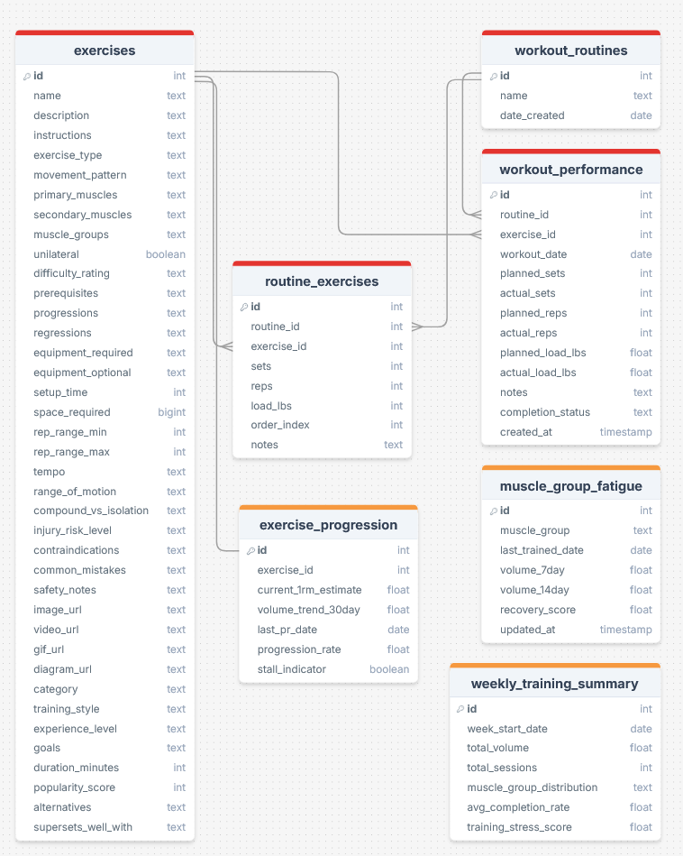

# RunStrong

RunStrong is a strength training resource for runners, enabling planning, tracking, and visualization of strength sessions and fatigue.

## Overview

- Provide a user-friendly web interface to evaluate and plan strength workouts

## Features

### 📌 Current Features 
- Exercise library tailored to runners
- Routine builder for reusable workout clusters
- Workout journal with fatigue and muscle group data entry
- Fatigue dashboard for muscle prioritization

### 🚀 Planned Features
- Schema redesign and UI improvements
- Dashboard rebuild
- Routine recommender based on recent muscle activity
- Integration with running workouts for complete fatigue picture
- Coach G integration for recovery/training advice

## Data Sources
- User-entered data

## Database ERD
